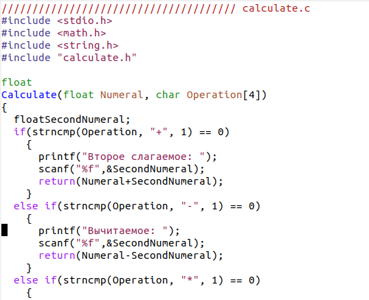
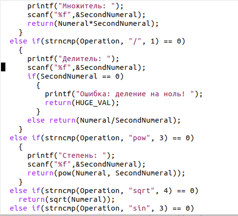
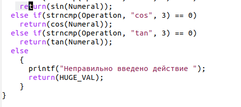
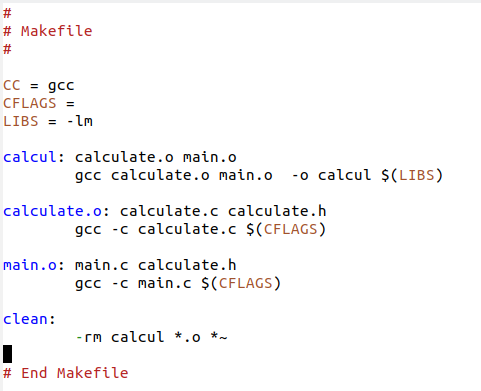
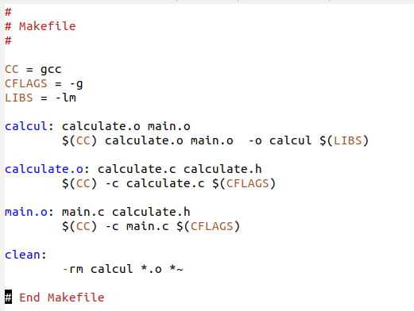
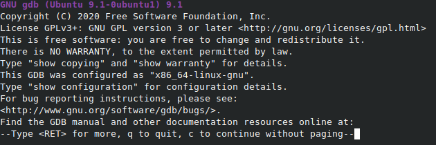
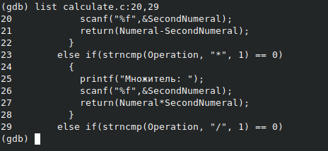
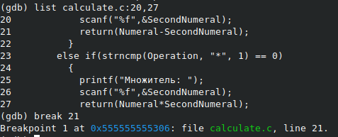
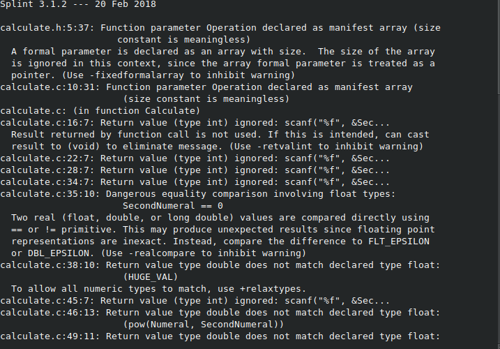
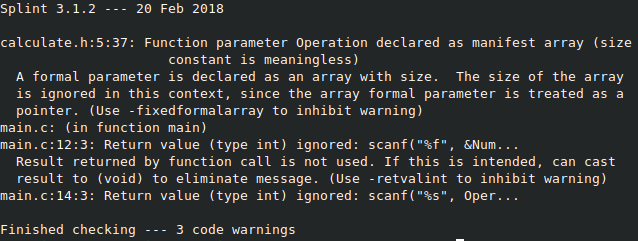

---
# Front matter
lang: ru-RU
title: "Лабораторная работа №14"
subtitle: "Российский университет дружбы народов"
author: "Андреев Владислав Владимирович"

# Formatting
toc-title: "Содержание"
toc: true # Table of contents
toc_depth: 2
lof: true # List of figures
lot: true # List of tables
fontsize: 12pt
linestretch: 1.5
papersize: a4paper
documentclass: scrreprt
polyglossia-lang: russian
polyglossia-otherlangs: english
mainfont: PT Serif
romanfont: PT Serif
sansfont: PT Sans
monofont: PT Mono
mainfontoptions: Ligatures=TeX
romanfontoptions: Ligatures=TeX
sansfontoptions: Ligatures=TeX,Scale=MatchLowercase
monofontoptions: Scale=MatchLowercase
indent: true
pdf-engine: lualatex
header-includes:
  - \linepenalty=10 # the penalty added to the badness of each line within a paragraph (no associated penalty node) Increasing the value makes tex try to have fewer lines in the paragraph.
  - \interlinepenalty=0 # value of the penalty (node) added after each line of a paragraph.
  - \hyphenpenalty=50 # the penalty for line breaking at an automatically inserted hyphen
  - \exhyphenpenalty=50 # the penalty for line breaking at an explicit hyphen
  - \binoppenalty=700 # the penalty for breaking a line at a binary operator
  - \relpenalty=500 # the penalty for breaking a line at a relation
  - \clubpenalty=150 # extra penalty for breaking after first line of a paragraph
  - \widowpenalty=150 # extra penalty for breaking before last line of a paragraph
  - \displaywidowpenalty=50 # extra penalty for breaking before last line before a display math
  - \brokenpenalty=100 # extra penalty for page breaking after a hyphenated line
  - \predisplaypenalty=10000 # penalty for breaking before a display
  - \postdisplaypenalty=0 # penalty for breaking after a display
  - \floatingpenalty = 20000 # penalty for splitting an insertion (can only be split footnote in standard LaTeX)
  - \raggedbottom # or \flushbottom
  - \usepackage{float} # keep figures where there are in the text
  - \floatplacement{figure}{H} # keep figures where there are in the text
---

# Цель работы

Приобрести простейшие навыки разработки, анализа, тестирования и отладки приложений в ОС типа UNIX/Linux на примере создания на языке программирова-ния С калькулятора с простейшими функциями.

# Выполнение лабораторной работы

1.В домашнем каталоге создаём подкаталог ~/work/os/lab_prog.

2.Создаём в нём файлы: calculate.h, calculate.c, main.c. Это будет примитивнейший калькулятор, способный складывать, вычитать, умножать и делить, возводить число в степень, брать квадратный корень, вычислять sin, cos, tan. При запуске он будет запрашивать первое число, операцию, второе число. После этого программа выведет результат и остановится.

Командный файл calculate.c и его код(Рисунок 2.1, 2.2, 2.3).

{ width=100% }

{ width=100% }

{ width=100% }

Командный файл calculate.h и его код(Рисунок 2.4).

{ width=100% }

Командный файл main.c и его код(Рисунок 2.5).

{ width=100% }

3.Выполняем компиляцию программы посредством gcc: 

gcc -c calculate.c 

gcc -c main.c 

gcc calculate.o main.o -o calcul -lm

4.Исправляем синтаксические ошибки.

5.Создаём Makefile(Рисунок 2.6).

{ width=100% }

Данный файл необходим для автоматической компиляции файлов calculate.c(цель calculate.o), main.c(цель main.o), а также их объединения в один исполняемый файл calcul(цель calcul). Цель clean нужна для автоматического удаления файлов. Переменная CC отвечает за утилиту для компиляции. Переменная CFLAGS отвечает за опции в данной утилите.Переменная LIBS отвечает за опции для объединения объектных файлов в один исполняемый файл.

6.Исправляем Makefile(Рисунок 2.7). 

{ width=100% }

В переменную CFLAGS добавляем опцию -g, необходимую для компиляции объектных файлов и их использования в программе отладчика GDB. Делаем так, что утилита компиляции выбирается с помощью переменной CC. После этого удаляем исполняемые и объектные файлы из каталога с помощью команды «make clean». Выполняем компиляцию файлов, используя команды «make calculate.o», «make main.o», «make calcul».

Далее с помощью gdb выполняем отладку программы calcul. Запускаем отладчик GDB, загрузив в него программу для отладки, используя команду:«gdb./calcul»(Рисунок 2.8).

{ width=100% }

Для запуска программы внутри отладчика вводим команду run(Рисунок 2.9).

{ width=100% }

Для постраничного(по 10 строк) просмотра исходного кода используем команду list(Рисунок 2.10).

{ width=100% }

Для просмотра строк с 12 по 15 основного файла использовала команду list 12,15(Рисунок 2.11).

{ width=100% }

Для просмотра определённых строк неосновного файла используем команду list calculate.c:20,29(Рисунок 2.12).

{ width=100% }

Установливаем точку останова в файле calculate.c на строке номер 21, используя команды list calculate.c:20,27 и break 21(Рисунок 2.13).

{ width=100% }

Выводим информацию об имеющихся в проекте точках останова с помощью команды info breakpoints(Рисунок 2.14).

{ width=100% }

Запусткаем программу внутри отладчика и убеждаемся, что программа остановилась в момент прохождения точки останова. Используем команды run, 5, − и backtrace(Рисунок 2.15).

{ width=100% }

Смотрим, чему равно на этом этапе значение переменной Numeral, введя команду print Numeral(Рисунок 2.16).

{ width=100% }

Сравниваем с результатом вывода на экран после использования команды display Numeral. Значения совпадают(Рисунок 2.17).

{ width=100% }

Убираем точки останова с помощью команд info breakpoints и delete 1(Рисунок 2.18).

{ width=100% }

7.Далее воспользуемся командами splint calculate.c и splint main.c. C помощью утилиты splint выяснилось, что в файлах calculate.c и main.c присутствует функция чтения scanf, возвращающая целое число(тип int), но эти числа не используются и нигде не сохранятся. Утилита вывела предупреждение о том, что в файле calculate.c происходит сравнение вещественного числа с нулем. Также возвращаемые значения(тип double) в функциях pow, sqrt, sin, cos и tan записываются в переменную типа float, что свидетельствует о потери данных(Рисунок 2.19, 2.20).

{ width=100% }

{ width=100% }

# Выводы

Я приобрёл простейшие навыки разработки, анализа, тестирования и отладки приложений в ОС типа UNIX/Linux на примере создания на языке программирования С калькулятора с простейшими функциями.

# Ответы на контрольные вопросы

1)Чтобы получить информацию о возможностях программ gcc, make, gdb и др. нужно воспользоваться командой man или опцией -help(-h) для каждой команды.

2)Процесс разработки программного обеспечения обычно разделяется на следующие этапы: 
планирование,  включающее  сбор  и  анализ  требований  к функционалу  и  другим  характеристикам  разрабатываемого приложения; 
проектирование,  включающее  в  себя  разработку  базовых алгоритмов    и    спецификаций,    определение    языка программирования; 
непосредственная разработка приложения: 
	кодирование − по  сути  создание  исходного  текста программы (возможно в нескольких вариантах); –анализ разработанного кода; 
	сборка, компиляция и разработка исполняемого модуля; 
	тестирование  и  отладка,  сохранение  произведённых изменений; 
документирование.

Для  создания  исходного  текста  программы  разработчик  может воспользоваться любым удобным для него редактором текста: vi, vim, mceditor, emacs, geany и др. После  завершения  написания  исходного  кода  программы  (возможно состоящей из нескольких файлов), необходимо её скомпилировать и получить исполняемый модуль.

3)Для имени  входного  файла  суффикс  определяет  какая  компиляция требуется. Суффиксы указывают на тип объекта. Файлы с расширением (суффиксом) .c воспринимаются gcc как программы на языке С, файлы с  расширением  .cc или .C − как  файлы  на  языке C++,  а  файлы c расширением .o считаются объектными. Например, в команде «gcc-c main.c»: gcc по расширению (суффиксу) .c распознает тип файла для компиляции и формирует объектный модуль − файл с расширением .o. Если требуется получить исполняемый файл с определённым именем (например, hello), то требуется воспользоваться опцией -o и в качестве параметра задать имя создаваемого файла: «gcc- o hello main.c».

4)Основное  назначение  компилятора языка  Си  в UNIX заключается  в 
компиляции всей программы и получении исполняемого файла/модуля.

5)Для сборки разрабатываемого приложения и собственно компиляции полезно   воспользоваться   утилитой make.   Она позволяет автоматизировать процесс преобразования файлов программы из одной формы в другую, отслеживает взаимосвязи между файлами.

6)Для работы с утилитой make необходимо в корне рабочего каталога с Вашим проектом создать файл с названием makefile или Makefile, в котором  будут  описаны  правила  обработки  файлов  Вашего программного комплекса. В самом простом случае Makefile имеет следующий синтаксис: 
<цель_1> <цель_2> ... : <зависимость_1> <зависимость_2> ... <команда 1> ... <команда n>
Сначала задаётся список целей, разделённых пробелами, за которым идёт двоеточие и список зависимостей. Затем в следующих строках указываются  команды.  Строки  с  командами  обязательно  должны начинаться с табуляции. В качестве цели в Makefile может выступать имя файла или название какого-то действия. Зависимость задаёт исходные параметры (условия) для  достижения  указанной  цели.  Зависимость  также  может  быть названием  какого-то  действия.  Команды  −  собственно  действия, которые необходимо выполнить для достижения цели.Общий синтаксис Makefile имеет вид: 
target1 [target2...]:[:] [dependment1...]
[(tab)commands] [#commentary]
[(tab)commands] [#commentary]

Здесь знак # определяет начало комментария (содержимое от знака # и до  конца  строки  не  будет  обрабатываться.  Одинарное  двоеточие указывает на то, что последовательность команд должна содержаться в одной строке. Для переноса можно в длинной строке команд можно использовать обратный слэш (\). Двойное двоеточие указывает на то, что  последовательность  команд  может  содержаться  в  нескольких последовательных строках. Пример более сложного синтаксиса Makefile:

 Makefile for abcd.c
 
 CC = gcc
 CFLAGS =
  Compile abcd.c normaly
  abcd: abcd.c
  $(CC) -o abcd $(CFLAGS) abcd.c
  clean:-rm abcd *.o *~
  EndMakefileforabcd.c
  
  В этом примере в начале файла заданы три переменные: CC и CFLAGS. Затем указаны цели, их зависимости и соответствующие команды. В командах  происходит  обращение  к  значениям  переменных.  Цель  с именем clean производит очистку каталога от файлов, полученных в результате  компиляции. Для  её  описания  использованы  регулярные выражения.

7)Во  время  работы  над  кодом  программы  программист  неизбежно сталкивается с появлением ошибок в ней. Использование отладчика для поиска и устранения ошибок в программе существенно облегчает жизнь программиста. В комплект программ GNU для ОС типа UNIXвходит отладчик GDB(GNU Debugger). Для использования GDBнеобходимо скомпилировать анализируемый код  программы  таким  образом,  чтобы  отладочная  информация содержалась  в  результирующем  бинарном  файле.  Для  этого  следует воспользоваться опцией -g компилятора gcc: gcc -c file.c -g
После этого для начала работы с gdb необходимо в командной строке ввести  одноимённую  команду,  указав  в  качестве  аргумента анализируемый бинарный файл: gdb file.o

8)Основные команды отладчика gdb:
backtrace−вывод на экран пути к текущей точке останова (по сутивывод − названий всех функций)
break −установить точку останова (в качестве параметра можетбыть указан номер строки или название функции)
clear −удалить все точки останова в функции
continue −продолжить выполнение программы
delete −удалить точку останова
display −добавить  выражение  в  список  выражений,  значения которых  отображаются  при  достижении  точки  останова программы
finish −выполнить программу до момента выхода из функции
info breakpoints −вывести на экран список используемых точек останова
info  watchpoints −вывести  на  экран  список  используемых контрольных выражений
list −вывести на экран исходный код (в качестве параметра может быть указано название файла и через двоеточие номера начальнойи конечной строк)
next −выполнить  программу  пошагово,  но  без  выполнения вызываемых в программе функций
print −вывести  значение  указываемого  в  качестве  параметра выражения
run −запуск программы на выполнение
set −установить новое значение переменной
step −пошаговое выполнение программы
watch −установить  контрольное  выражение,  при  изменении значения которого программа будет остановлена

Для выхода из gdb можно воспользоваться командой quit(или её сокращённым  вариантом q)  или  комбинацией  клавиш Ctrl-d. Более подробную информацию по работе с gdb можно получить с помощью команд gdb -h и man gdb.

9)Cхема отладки программы показана в 6 пункте лабораторной работы.

10)При первом запуске компилятор не выдал никаких ошибок, но в коде программы main.c допущена  ошибка,  которую  компилятор  мог пропустить (возможно, из-за версии 8.3.0-19): в строке  scanf(“%s”, &Operation); нужно убрать знак &, потому что имя массива символов уже является указателем на первый элемент этого массива.

11)Система  разработки приложений UNIX предоставляет  различные средства, повышающие понимание исходного кода. 
К ним относятся:
cscope −исследование функций, содержащихся в программе,
lint −критическая проверка программ, написанных на языке Си.

12)Утилита splint анализирует  программный  код,  проверяет корректность  задания  аргументов  использованных  в  программе функций   и   типов   возвращаемых   значений,   обнаруживает синтаксические и семантические ошибки. В отличие от компилятора Cанализатор splint генерирует комментарии с описанием разбора кода программы и осуществляет общий контроль, обнаруживая такие ошибки, как одинаковые объекты, определённые в разных файлах, или объекты, чьи значения не используются в работе программы,  переменные  с  некорректно  заданными  значениямии типами и многое другое.
