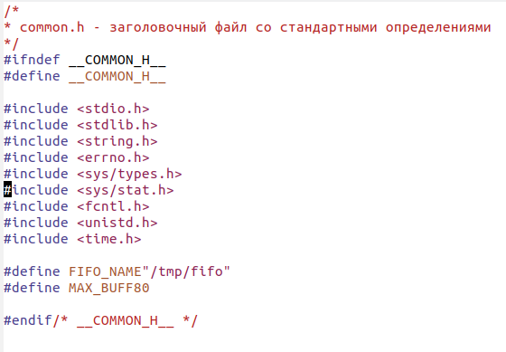
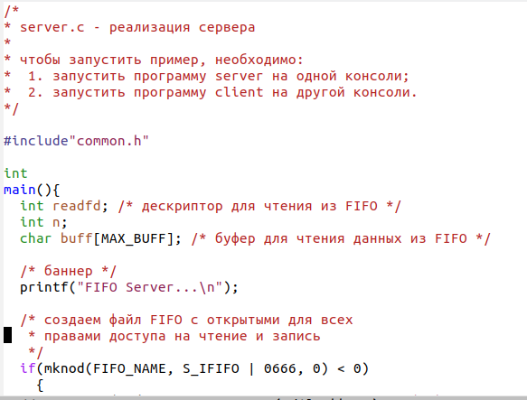
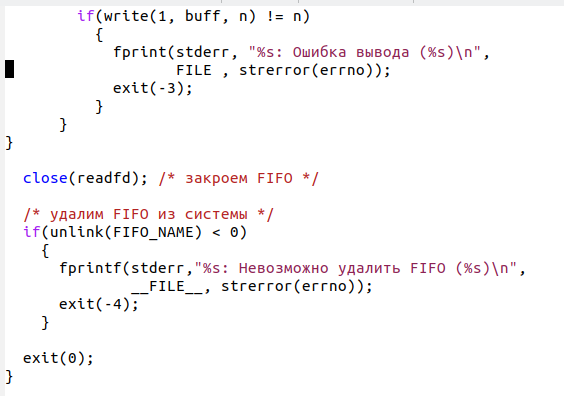
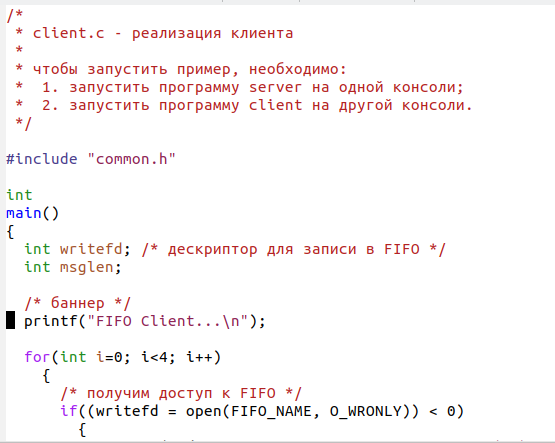
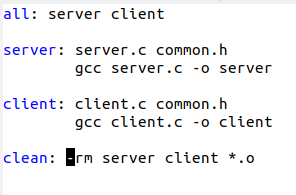
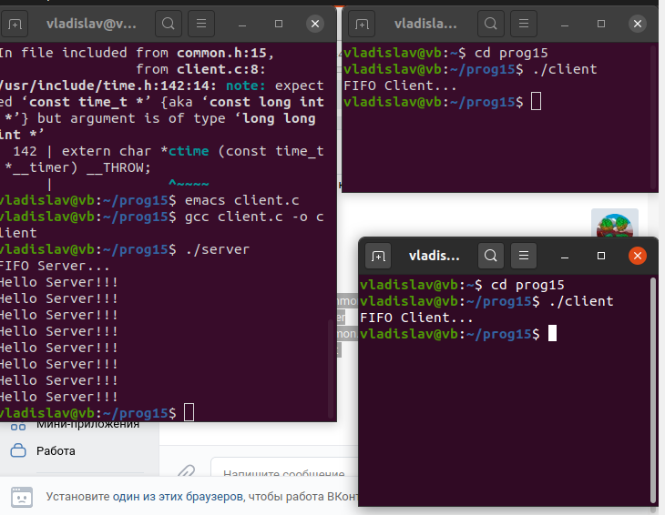

---
# Front matter
lang: ru-RU
title: "Лабораторная работа №15"
subtitle: "Российский университет дружбы народов"
author: "Андреев Владислав Владимирович"

# Formatting
toc-title: "Содержание"
toc: true # Table of contents
toc_depth: 2
lof: true # List of figures
lot: true # List of tables
fontsize: 12pt
linestretch: 1.5
papersize: a4paper
documentclass: scrreprt
polyglossia-lang: russian
polyglossia-otherlangs: english
mainfont: PT Serif
romanfont: PT Serif
sansfont: PT Sans
monofont: PT Mono
mainfontoptions: Ligatures=TeX
romanfontoptions: Ligatures=TeX
sansfontoptions: Ligatures=TeX,Scale=MatchLowercase
monofontoptions: Scale=MatchLowercase
indent: true
pdf-engine: lualatex
header-includes:
  - \linepenalty=10 # the penalty added to the badness of each line within a paragraph (no associated penalty node) Increasing the value makes tex try to have fewer lines in the paragraph.
  - \interlinepenalty=0 # value of the penalty (node) added after each line of a paragraph.
  - \hyphenpenalty=50 # the penalty for line breaking at an automatically inserted hyphen
  - \exhyphenpenalty=50 # the penalty for line breaking at an explicit hyphen
  - \binoppenalty=700 # the penalty for breaking a line at a binary operator
  - \relpenalty=500 # the penalty for breaking a line at a relation
  - \clubpenalty=150 # extra penalty for breaking after first line of a paragraph
  - \widowpenalty=150 # extra penalty for breaking before last line of a paragraph
  - \displaywidowpenalty=50 # extra penalty for breaking before last line before a display math
  - \brokenpenalty=100 # extra penalty for page breaking after a hyphenated line
  - \predisplaypenalty=10000 # penalty for breaking before a display
  - \postdisplaypenalty=0 # penalty for breaking after a display
  - \floatingpenalty = 20000 # penalty for splitting an insertion (can only be split footnote in standard LaTeX)
  - \raggedbottom # or \flushbottom
  - \usepackage{float} # keep figures where there are in the text
  - \floatplacement{figure}{H} # keep figures where there are in the text
---

# Цель работы

Приобретение практических навыков работы с именованными каналами.

# Выполнение лабораторной работы

1.Создаём необходимые файлы с помощью команды "touch common.h server.c client.c Makefile"(Рисунок 2.1).

{ width=100% }

2.Изменяем файлы. В файл common.h добавляем стандартные заголовочные файлы unistd.h и time.h,  необходимые  для  работы  кодов  других  файлов. Common.h предназначен для заголовочных файлов, чтобы в остальных программах их не прописывать каждый раз(Рисунок 2.2).

{ width=100% }

В файл server.c добавяем цикл while для контроля за временем работы сервера.  Разница  между текущим  временем time(NULL) и  временем начала работы clock_t start=time(NULL) (инициализация до цикла) не должна превышать 30 секунд(Рисунок 2.3, 2.4, 2.5).

{ width=100% }

{ width=100% }

{ width=100% }

В  файл client.c добавляем  цикл,  который  отвечает  за  количество сообщений о текущем времени (4 сообщения), которое получается  в результате  выполнения  команд  и команду sleep(5) для приостановки работы клиента на 5 секунд(Рисунок 2.6, 2.7).

{ width=100% }

{ width=100% }

Makefile оставляем без изменения(Рисунок 2.8).

{ width=100% }

3.После написания кодов, используя команду «make all», скомпилируем необходимые файлы(Рисунок 2.9).

{ width=100% }

Проверим корректность работы. Отрываем  3  консоли и  запускаем:  в  первом  терминале − «./server», в остальных двух –«./client». В результате каждый терминал вывел по 4 сообщения. Спустя 30 секунд работа сервера была прекращена. Программа работает корректно(Рисунок 2.10).

{ width=100% }

Также отдельно проверим длительность  работы  сервера,  введя команду «./server» в одном терминале. Он завершил свою работу через 30 секунд.Если сервер завершит свою работу, не закрыв канал, то, когда мы будем запускать  этот  сервер  снова,  появится  ошибка «Невозможно  создать FIFO», так как у нас уже есть один канал.

# Выводы

Я приобрёл практические навыки работы с именованными каналами.

# Ответы на контрольные вопросы

1)Именованные  каналы  отличаются  от  неименованных  наличием идентификатора  канала,  который представлен  как  специальный файл (соответственно имя именованного канала −это имя файла). Поскольку файл  находится  на  локальной  файловой  системе,  данное IPCиспользуется внутри одной системы.

2)Чтобы  создать  неименованный  канал из  командной  строкинужно использовать  символ |,  служащий  для  объединения  двух  и  более процессов: процесс_1 |процесс_2 | процесс_3...

3)Чтобы  создатьименованный  канал  из  командной  строкинужно использовать  либо  команду «mknod<имя_файла>», либо  команду «mkfifo<имя_файла>».

4)Неименованный  канал  является  средством  взаимодействия  между связанными  процессами −родительским  и  дочерним.  Родительский процесс  создает  канал  при  помощи  системного  вызова: «int  pipe(int fd[2]);».
Массив  из  двух  целых  чисел  является  выходным  параметром  этого системного вызова. Если вызов выполнился нормально, то этот массив содержит два файловых дескриптора. fd[0] является дескриптором для чтения  из  канала, fd[1] −дескриптором  для  записи  в  канал.  Когда процесс  порождает  другой  процесс,  дескрипторы  родительского процесса  наследуются  дочерним  процессом,  и,  таким  образом, прокладывается  трубопровод  между  двумя  процессами.  Естественно, что один из процессов использует канал только для чтения, а другой −только  для  записи. Поэтому,  если,  например,  через  канал  должны передаваться  данные  из  родительского  процесса  в  дочерний, родительский  процесс  сразу  после  запуска  дочернего  процесса закрывает дескриптор канала для чтения, а дочерний процесс закрывает дескриптор для записи. Если нужен двунаправленный обмен данными между процессами, то родительский процесс создает два канала, один из которых используется для передачи данных в одну сторону, а другой −в другую.

5)Файлы  именованных  каналов  создаются  функцией mkfifo()или функцией mknod:«intmkfifo(constchar*pathname, mode_tmode);», где первый параметр  −  путь,  где  будет  располагаться FIFO (имя  файла, идентифицирующего канал), второй параметр определяет режим работы с FIFO (маска прав доступа к файлу),«mknod (namefile, IFIFO | 0666, 0)», где namefile −имя канала, 0666 −к каналу разрешен доступ на запись и на чтение любому запросившему процессу),«int mknod(const char *pathname, mode_t mode, dev_t dev);».Функцияmkfifo() создает канал и файл соответствующего типа. Если указанный файл канала уже существует, mkfifo() возвращает -1. После создания  файла  канала  процессы,  участвующие  в  обмене  данными, должны открыть этот файл либо для записи, любо для чтения.

6)При чтении меньшего числа байтов, чем находится в канале или FIFO, возвращается  требуемое  число  байтов,  остаток  сохраняется  для последующих чтений.При чтении большего числа байтов, чем находится в канале или FIFO, возвращается доступное число байтов. Процесс, читающий из канала, должен  соответствующим  образом  обработать  ситуацию,  когда прочитано меньше, чем заказано.

7)Запись  числа  байтов,  меньшего  емкости  канала  или FIFO, гарантированно атомарно. Это означает, что в случае, когда несколько процессов одновременнозаписывают в канал, порции данных от этих процессов не перемешиваются.При записи большего числа байтов, чем это позволяет канал или FIFO, вызов write(2) блокируется  до  освобождения  требуемого  места.  При этом атомарность операции не гарантируется. Если процесс пытается записать данные в канал, не открытый ни одним процессом на чтение, процессу генерируется сигнал SIGPIPE, а вызов write(2) возвращает 0 с установкой  ошибки (errno=ERRPIPE) (если  процесс  не  установил обработки сигнала SIGPIPE, производится обработка по умолчанию −процесс завершается).

8)Количество процессов, которые могут параллельно присоединяться к любому  концу  канала,  не  ограничено.  Однако  если  два  или  более процесса записывают в канал данные одновременно, каждый процесс за один  раз  может  записать  максимум PIPE  BUF байтов  данных. Предположим,  процесс  (назовем  его  А)  пытается  записать X байтов данных в канал, в котором имеется место для Y байтов данных. Если X больше, чем Y, только первые Y байтов данных записываются в канал, и процесс блокируется. Запускается другой процесс (например. В); в это время в канале появляется свободное пространство (благодаря третьему процессу,  считывающему  данные  из  канала).  Процесс  В  записывает данные в канал. Затем, когда выполнение процесса А возобновляется, 
он записывает оставшиеся X-Y байтов данных в канал. В результате данные  в  канал  записываются  поочередно  двумя  процессами. Аналогичным образом, если два (или более) процесса одновременно попытаются  прочитать  данные  из  канала,  может  случиться  так,  что каждый из них прочитает только часть необходимых данных.

9)Функция write записывает  байты count из  буфера buffer вфайл, связанный  с handle. Операции write начинаются  с  текущей  позиции указателя на файл (указатель ассоциирован с заданным файлом). Если файл открыт для добавления, операции выполняются в конец файла. После осуществления операций записи указатель нафайл(если он есть) увеличивается на количество действительно записанных байтов.Функция write возвращает  число действительно  записанныхбайтов. Возвращаемое значение должно быть положительным, но меньше числа count (например,  когда  размер  для записи count   байтоввыходит за пределы пространства на диске). Возвращаемое значение-1 указывает на ошибку; errno устанавливается в одно из следующихзначений:EACCES − файл открыт для чтения или закрыт длязаписи,EBADF− неверный handle-р файла,ENOSPC − на устройстве нет свободного места.Единица  в  вызове  функции writeв  программе server.cозначаетидентификатор (дескриптор потока) стандартного потока вывода.

10)Прототип функции strerror: «char * strerror( int errornum );».Функцияstrerrorинтерпретирует  номер  ошибки,  передаваемый  в функцию  в  качестве  аргумента −errornum, в  понятное  для  человека текстовое сообщение (строку). Откуда берутся эти ошибки? Ошибки эти возникают  при  вызове  функций  стандартных  Си-библиотек.  То  есть хорошим  тоном  программирования  будет −использование  этой функции в паре с другой, и если возникнет ошибка, то пользователь или программист поймет,как  исправить  ошибку,  прочитав  сообщение функции strerror.
Возвращенный указатель ссылается на статическую строку с ошибкой, которая  не  должна  быть  изменена  программой.  Дальнейшие  вызовы функции strerror перезапишут   содержание   этой   строки. Интерпретированные  сообщения  об  ошибках  могут  различаться,  это зависит от платформы и компилятора
